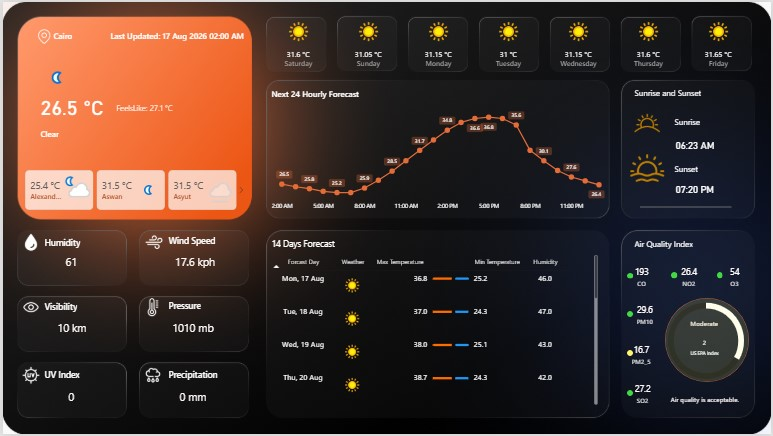
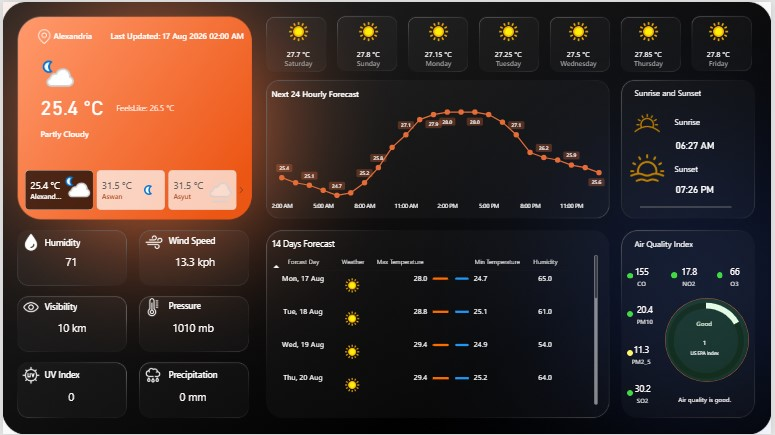
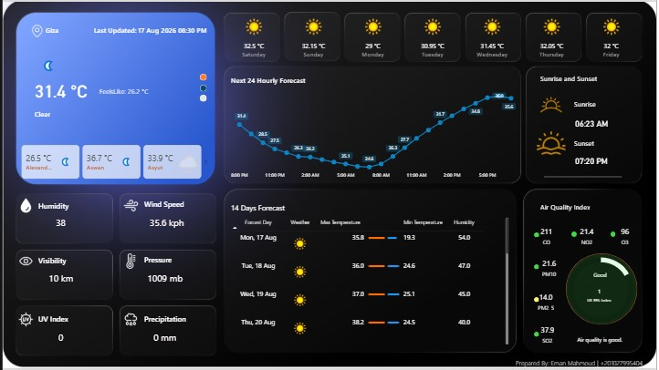
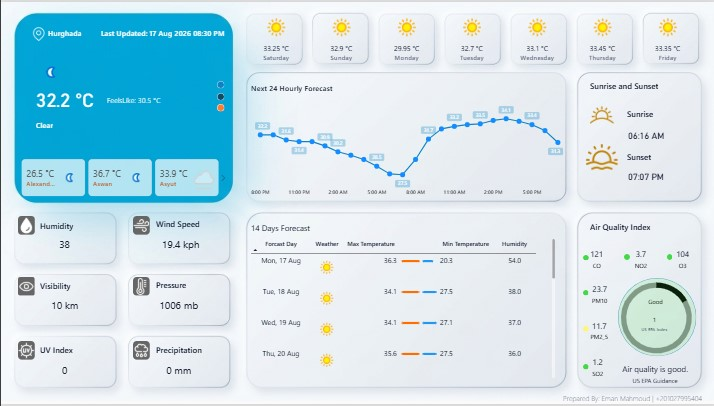

# 🌦️ Real-Time Weather Analytics Dashboard | Power BI

> **Turning live weather API data into an interactive and analytical weather experience.**

A Power BI dashboard built to transform live weather API data into a clean, interactive experience covering **current weather conditions, hourly and daily forecasts, and air quality indicators**.

This project represents the complete journey from **API integration and data transformation to data modeling, DAX measures, dynamic formatting, and professional dashboard design**.

---

## 📌 Project Overview

The goal was not simply to display weather information.

The goal was to take a raw API response, understand its structure, transform it into an analytical model, create meaningful calculations, and turn the results into a dashboard that is easy to explore and understand.

### Current Dashboard Scope

- 🌡️ Current weather conditions
- 📈 Hourly temperature trend
- 📅 Multi-day weather forecast
- 🌡️ Average, maximum and minimum forecast temperature
- 💧 Humidity analysis
- 💨 Wind information
- 🌧️ Rain probability and precipitation
- 🌅 Sunrise and sunset
- 🌫️ Air quality indicators
- 🎨 Dynamic air-quality colors
- 🕐 Last updated information
- 🌑 Dark Mode
- ☀️ Light Mode

---

# 🎯 Project Objectives

The project was built to:

- Connect Power BI to a live weather API.
- Retrieve current weather and forecast data.
- Transform nested API responses into structured analytical tables.
- Clean and standardize the data.
- Build a structured Power BI data model.
- Create a dedicated Date Dimension.
- Develop reusable DAX measures.
- Analyze hourly and daily weather information.
- Present air quality indicators in an intuitive visual format.
- Use dynamic conditional formatting based on air-quality values.
- Build a professional dashboard with a clear visual hierarchy.

---

# 🔌 1. API Integration

The project uses **WeatherAPI** as the primary data source.

Power BI connects to the API through Power Query and retrieves weather information dynamically.

The API request includes:

- Location
- Forecast days
- Air quality data
- Current weather
- Daily forecast
- Hourly forecast

A custom Power Query function was created to request forecast data for a given city.

The function receives the city as an input and returns the API response as a record, which is then transformed into analytical tables.

### 🔐 API Security

The API key is **not hard-coded into the Power Query M code**.

The connection was configured using:

- HTTPS
- Web API authentication
- `ApiKeyName`
- Power BI credential management

The private API credential is therefore kept outside the public M code and is not included in the public project files.

---

# 🧹 2. Data Transformation & Cleaning

The raw API response contains nested records and lists.

Power Query was used to progressively expand and transform these structures.

The transformation process included:

- Expanding location information.
- Expanding current weather information.
- Expanding forecast data.
- Expanding daily forecast records.
- Expanding hourly forecast records.
- Expanding weather condition records.
- Expanding astronomical information.
- Expanding air quality information.
- Removing unnecessary columns.
- Renaming columns using consistent naming conventions.
- Assigning appropriate data types.
- Handling invalid values.
- Converting time fields correctly.

### 🛠️ Data Quality Handling

One of the practical cleaning challenges involved the `Moonset` field.

Some API responses contained invalid text values instead of valid time values.

The invalid values were handled as `null`, after which the column was converted to the appropriate `Time` data type.

This allowed the rest of the transformation process to remain stable.

---

# 🏗️ 3. Data Model

The project uses a structured model consisting of dimension and fact tables.

### Dimensions

- `Dim_Location`
- `Dim_Date`

### Fact Tables

- `Fact_Current`
- `Fact_Forecast_Daily`
- `Fact_Forecast_Hourly`

### Model Structure

```text
Dim_Location
     │
     ├── Fact_Current
     ├── Fact_Forecast_Daily
     └── Fact_Forecast_Hourly

Dim_Date
     │
     ├── Fact_Forecast_Daily
     └── Fact_Forecast_Hourly
```

The relationships between the tables were created and validated to support filtering and analysis across the dashboard.

---

# 📅 4. Date Dimension

A dedicated `Dim_Date` table was created dynamically from the forecast date range.

The table includes:

- Date
- Year
- Month Number
- Month Name
- Day Number
- Day Name
- Day of Week Number
- Quarter
- Week Number
- Year-Month
- Year-Month Number

Sorting was configured to maintain chronological order for:

- Month names
- Day names
- Year-Month labels

The week numbering was configured with **Saturday as the first day of the week**.

The `Dim_Date` table was also marked as a formal Date Table in Power BI.

---

# 🧮 5. DAX Measures

A dedicated `Measures` table was created to keep calculations organized separately from the fact tables.

Display folders were used to structure the measures.

### Measure Organization

```text
Measures
│
├── Current Weather
│
├── Daily Forecast
│   ├── Rain
│   ├── Temperature
│   ├── Humidity
│   └── Wind
│
├── Hourly Forecast
│
└── General
```

The measures cover the main analytical areas of the dashboard, including:

- Current temperature
- Current humidity
- Current wind speed
- Forecast average temperature
- Forecast maximum temperature
- Forecast minimum temperature
- Average humidity
- Rain probability
- Total precipitation
- Wind metrics
- Last updated information

The measures were designed to respond dynamically to the current filter context.

---

# 🌡️ 6. Temperature Analysis

Temperature information is presented at both daily and hourly levels.

### Daily Forecast

The dashboard includes:

- Average forecast temperature
- Maximum forecast temperature
- Minimum forecast temperature

### Hourly Forecast

An hourly temperature trend was created using the hourly forecast data to visualize temperature changes throughout the forecast period.

The visual uses an hourly time axis to make temperature movement easier to interpret.

---

# 💧 7. Humidity

Humidity is included in the weather analysis through dedicated measures and dashboard indicators.

It is presented alongside other weather conditions to provide a more complete view of the current and forecast weather situation.

---

# 💨 8. Wind Analysis

Wind information was incorporated through dedicated wind measures and dashboard indicators.

The available wind-related information from the API is presented in a compact analytical format.

---

# 🌧️ 9. Rain Analysis

The daily forecast contains two important precipitation-related indicators:

### `TotalPrecipitation_MM`

Represents the expected precipitation amount in millimeters.

Both fields were assigned appropriate numeric data types during the cleaning stage.

The dashboard uses both indicators to provide a clearer picture of expected rainfall conditions.

---

# 🌅 10. Sunrise & Sunset

Astronomical information retrieved from the API was incorporated into the dashboard.

The dashboard presents:

- Sunrise
- Sunset

This information is displayed as part of the daily weather experience.

---

# 🌫️ 11. Air Quality Analysis

Air quality is one of the main analytical sections of the dashboard.

The API provides the following air-quality indicators:

- CO
- NO₂
- O₃
- SO₂
- PM2.5
- PM10
- US EPA Index
- GB DEFRA Index

These values were extracted from the nested API response and incorporated into the current-weather dataset.

---

# 🎨 12. Dynamic Air Quality Visualization

Instead of presenting air quality only as numerical cards, the dashboard uses circular visual indicators whose colors change dynamically according to the corresponding values.

DAX color measures were created for the air-quality indicators and applied through conditional formatting.

The visual state changes automatically as the underlying value changes.

This creates a more intuitive experience where the user can understand the severity level visually without having to interpret every number.

### Example — PM2.5

The implemented PM2.5 color logic progresses through:

```text
Good
   ↓
Moderate
   ↓
Unhealthy for Sensitive Groups
   ↓
Unhealthy
   ↓
Very Unhealthy
   ↓
Hazardous
```

---

# 🎨 13. Dashboard Design

The dashboard was designed with a focus on:

- Visual hierarchy
- Readability
- Consistency
- Clear grouping of information
- Practical use of color
- Easy comparison
- Interactive exploration

The layout separates current conditions, hourly trends, daily forecasts, and air quality into clearly identifiable sections.

---

## 🌑 Dark Mode

A dark dashboard theme was developed using a dark background with weather-related accent colors.

The design emphasizes:

- High contrast
- Strong visual hierarchy
- Orange weather accents
- Clear KPI cards
- Dynamic air-quality colors

---

## ☀️ Light Mode

A Light Mode version was also designed using:

- Light neutral background
- White cards
- Professional blue accents
- Orange weather highlights
- Dark typography

The same analytical structure is maintained across both themes.

---

# 🧠 14. Key Challenges & Solutions

### Nested API Data

**Challenge:** The API response contained nested records and lists.

**Solution:** Power Query was used to progressively expand records and lists until the required analytical fields were available.

### Invalid Time Values

**Challenge:** Some `Moonset` values were returned as text.

**Solution:** Invalid values were handled as `null`, and the field was converted to the correct Time data type.

### Different Data Granularity

**Challenge:** Current, daily, and hourly weather data have different levels of granularity.

**Solution:** Separate fact tables were created for Current, Daily, and Hourly data, supported by shared dimensions.

### Dynamic Air Quality Colors

**Challenge:** Static colors would not communicate changing air-quality conditions.

**Solution:** DAX-based color measures were used with conditional formatting to make the visual indicators dynamic.

### Date Display vs. Sorting

**Challenge:** User-friendly date labels are text and therefore do not naturally sort chronologically.

**Solution:** The display labels were sorted using the underlying Date column, preserving readability and chronological order.

---

# 📊 15. Dashboard Features

The completed dashboard brings together:

- Current weather overview
- Temperature indicators
- Humidity
- Wind information
- Precipitation
- Hourly temperature trend
- Daily forecast
- Sunrise
- Sunset
- Air quality indicators
- US EPA Index
- GB DEFRA Index
- Dynamic air-quality colors
- Last updated timestamp
- Dark Mode
- Light Mode

---

# 🖼️ Dashboard Preview

## 🌑 Dark Mode

### Cairo



### Alexandria



### Giza



## ☀️ Light Mode



---

# 🛠️ Tools & Technologies

| Technology      | Purpose                                      |
| --------------- | -------------------------------------------- |
| **Power BI**    | Data modeling, DAX and visualization         |
| **Power Query** | API integration, transformation and cleaning |
| **DAX**         | Measures and dynamic calculations            |
| **WeatherAPI**  | Weather and air-quality data source          |
| **JSON**        | API response structure                       |
| **GitHub**      | Project documentation and version control    |

---

# 🚀 Future Development

The current project represents the completed scope of the present dashboard.

The following are intentionally presented as **future development opportunities**, not as implemented features.

### 🌍 Global Expansion

Expand the city coverage to include cities and countries around the world.

### 📊 Global Comparisons

Enable analytical comparisons between countries, cities, and regions.

### 🌡️ Comparative Weather Analysis

Compare temperature, humidity, precipitation, and wind conditions across locations.

### 🌫️ Global Air Quality Analysis

Extend the air-quality analysis to support cross-location and cross-country comparisons.

### 🗺️ Geographic Exploration

Introduce a global interactive map for exploring weather conditions by location.

### 📈 Historical Analysis

Add historical weather data to enable trend analysis over time.

These enhancements could transform the current dashboard into a broader **Global Weather Analytics platform**.

---

# 🔐 Data & Security

This repository does not contain the private API credential used during development.

The API key is managed through Power BI's Web API credential mechanism and is intentionally excluded from the public project files.

**Never publish:**

- API keys
- Passwords
- Private credentials
- Sensitive configuration values

If a credential is ever exposed publicly, it should be revoked or rotated immediately.

---

# 👩‍💻 About Me

## Eman Mahmoud

**Data Analyst | Power BI | Excel | SQL | Python | R | SPSS | EViews**

I am a Computer Engineering graduate developing my career in **Data Analytics and Business Intelligence**, while pursuing a Professional Master's in Data Analysis.

My background combines engineering, data analysis, and practical reporting experience.

I enjoy transforming raw data into structured analytical models and building dashboards that make complex information easier to understand.

### My Skills

<p>
  
  
  
  
  
  
  
  
  
</p>

---

## ⭐ Project Takeaway

This project started with a simple question:

> **How can raw weather API data become something useful, understandable, and visually engaging?**

The answer became a complete Power BI workflow:

**API → Power Query → Data Cleaning → Data Model → DAX → Dynamic Visualization → Dashboard**

The current architecture was built with future expansion in mind, with the potential to grow from selected locations into a broader global weather analytics experience.

---

## 📬 Connect

- **LinkedIn:** [LinkedIn](https://www.linkedin.com/in/eman-mahmoud-8b1689110/)
- **GitHub:** [GitHub](https://github.com/EmanMahmoud0/)
- **Portfolio:** [Portfolio](https://emanmahmoud0.github.io/Eman-Mahmoud_Data-Analyst_portfolio/)

---

> **Built with curiosity, patience, and a lot of Power BI debugging. 🌦️📊**
